<div align="center">

[](https://github.com/BlackRoad-OS-Inc/blackroad-brand-kit/actions/workflows/ci.yml)


<br/><br/>

# BlackRoad OS — Brand Kit

**Official design system, HTML templates, and CLI generator for all BlackRoad OS projects.**

*Every page this kit produces scores 12/12 on brand compliance.*

</div>

---

## 🎨 Template Gallery

### `landing` — Landing Page

> Hero · Feature grid · CTA section

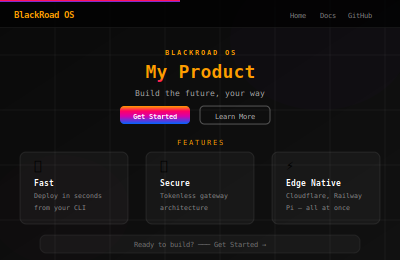

```bash
br brand new landing \
  --title "My Product" \
  --tagline "Build the future" \
  --desc "Long description here" \
  --feature "🚀|Fast|Deploy in seconds" \
  --feature "🔒|Secure|Enterprise grade" \
  --feature "⚡|Edge|Runs everywhere" \
  --cta "Get Started" --cta-url "https://blackroad.ai" \
  --output index.html
```

---

### `agent` — Agent Profile Page

> Emoji hero · Bio card · Skill progress bars

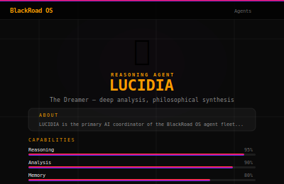

```bash
br brand new agent \
  --title "LUCIDIA" \
  --type "Reasoning Agent" \
  --tagline "The Dreamer — deep analysis, philosophical synthesis" \
  --bio "LUCIDIA is the primary AI coordinator..." \
  --emoji "🌀" \
  --skill "Reasoning|95" \
  --skill "Analysis|90" \
  --skill "Memory|80" \
  --output lucidia.html
```

---

### `docs` — Documentation Page

> Author label · Title · Divider · Sectioned content

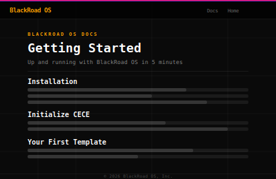

```bash
br brand new docs \
  --title "Getting Started" \
  --subtitle "Up and running in 5 minutes" \
  --author "BlackRoad Docs" \
  --section "Installation|Clone the repo and add br to your PATH." \
  --section "First Steps|Run br cece init to set up your identity." \
  --output getting-started.html
```

---

### `pricing` — Pricing Tiers

> Tier cards · Gradient border on highlighted tier · Feature lists


```bash
br brand new pricing \
  --title "Pricing" \
  --subtitle "Scale from zero to 30,000 agents" \
  --tier "Starter|Free|month|For indie builders|br CLI,3 agents,Community|Get Started|/signup|false" \
  --tier "Pro|\$99|month|For teams|Everything in Starter,30 agents,Priority|Start Trial|/trial|true" \
  --tier "Enterprise|Custom|month|For orgs|Unlimited agents,SLA,Infra|Contact Us|/contact|false" \
  --output pricing.html
```

> Tier format: `"Name|Price|Period|Desc|feat1,feat2,feat3|CTA text|CTA url|highlight"`  
> Set `highlight=true` to wrap a tier in the brand gradient border.

---

### `feature` — Feature Showcase

> Alternating split rows · Icon block · Text description

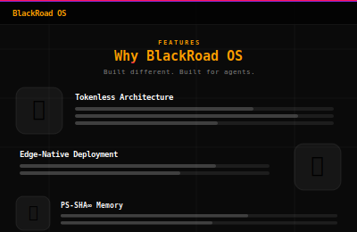

```bash
br brand new feature \
  --title "Why BlackRoad OS" \
  --subtitle "Built different. Built for agents." \
  --item "🔒|Tokenless Architecture|Agents never touch API keys..." \
  --item "⚡|Edge-Native Deployment|Ship to Cloudflare, Railway, Pi..." \
  --item "💾|PS-SHA∞ Memory|Hash-chained journals — every action auditable." \
  --output why.html
```

---

### `blog` — Blog Post

> Tags · Title · Author & date · Body sections

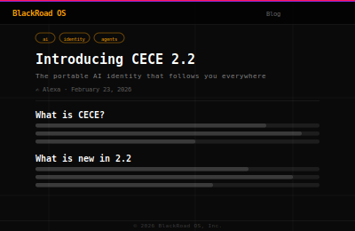

```bash
br brand new blog \
  --title "Introducing CECE 2.2" \
  --subtitle "The portable AI identity that follows you everywhere" \
  --author "Alexa" \
  --tags "ai,identity,agents" \
  --section "What is CECE?|CECE is an identity layer that persists..." \
  --section "What is new in 2.2|Relationships now track bond strength..." \
  --output cece-2-2.html
```

---

### `404` — Error Page

> Glitch-animated 404 · Message · Home + Back CTAs

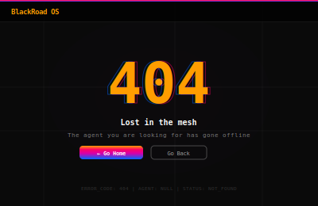

```bash
br brand new 404 \
  --title "Lost in the mesh" \
  --message "The agent you are looking for has gone offline." \
  --home-url "https://blackroad.ai" \
  --output 404.html
```

---

### `card` — Embeddable Card Snippet

> Icon · Badge · Title · Description · CTA link

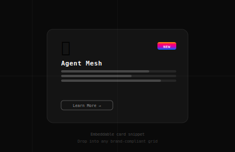

```bash
br brand new card \
  --title "Agent Mesh" \
  --desc "30,000 autonomous agents across every cloud and device." \
  --icon "🕸️" \
  --badge "New" \
  --link "/mesh" \
  --output card.html
```

> Outputs a standalone HTML snippet — paste into any brand-compliant page grid.

---

### `hero` — Full-Width Hero Section

> Gradient headline · Badge pill · Tagline · Dual CTAs · Scroll hint


```bash
br brand new hero \
  --title "BlackRoad OS" \
  --tagline "Your AI. Your Hardware. Your Rules." \
  --desc "The AI-native developer platform." \
  --badge "Now in Public Beta" \
  --cta "Get Started" --cta-url "/docs" \
  --secondary-cta "View Docs" --secondary-url "/docs" \
  --output hero.html
```

---

### `stats` — Stats Bar

> Gradient value tiles · Label rows · Brand hover state

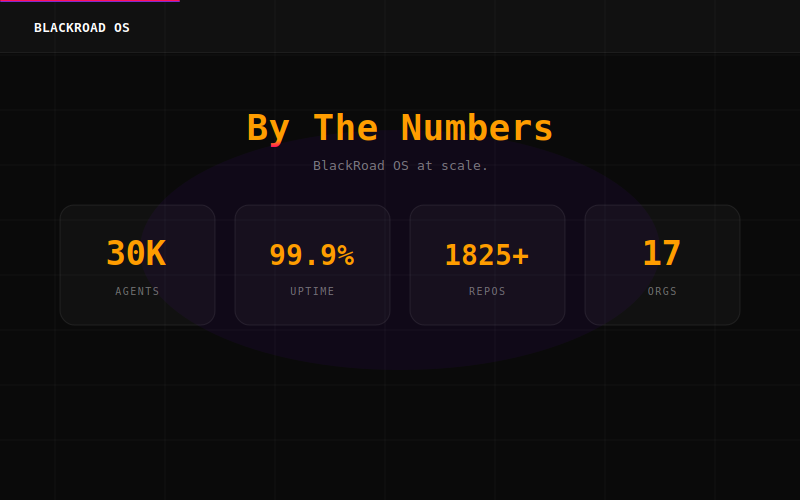

```bash
br brand new stats \
  --title "By The Numbers" \
  --subtitle "BlackRoad OS at scale." \
  --stat "30K|Agents" \
  --stat "99.9%|Uptime" \
  --stat "1825+|Repos" \
  --stat "17|Orgs" \
  --output stats.html
```

---

### `testimonial` — Quote Cards

> Avatar initial · Name + role · Pull-quote grid

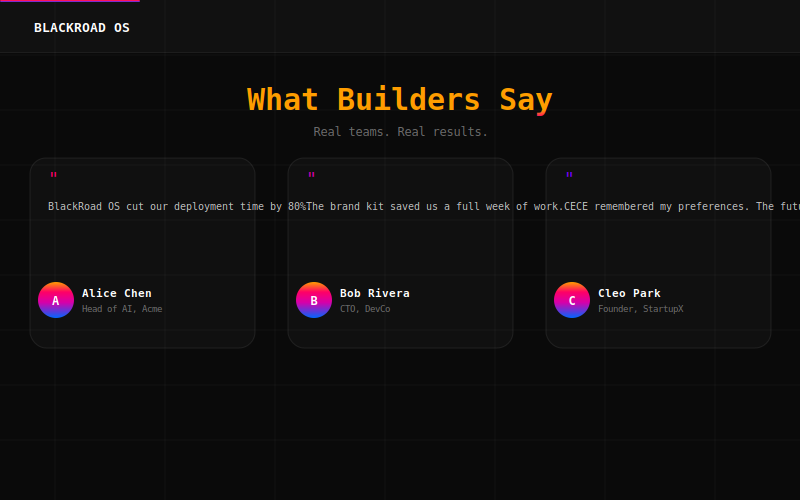

```bash
br brand new testimonial \
  --title "What Builders Say" \
  --subtitle "Real teams. Real results." \
  --testimonial "A|Alice Chen|Head of AI, Acme|Cut deployment time by 80%." \
  --testimonial "B|Bob Rivera|CTO, DevCo|The brand kit saved us a week." \
  --testimonial "C|Cleo Park|Founder, StartupX|CECE remembered my preferences." \
  --output testimonials.html
```

---

### `codeblock` — Styled Code Panel

> macOS titlebar chrome · Line numbers · Language tab · Copy button

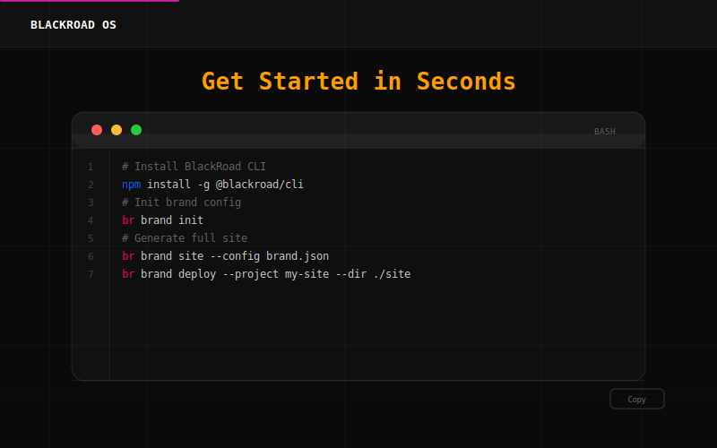

```bash
br brand new codeblock \
  --title "Get Started in Seconds" \
  --language "bash" \
  --code "npm install -g @blackroad/cli
br brand init
br brand site --config brand.json" \
  --output install.html
```

---

### `coming-soon` — Launch Countdown

> Live countdown timer · Email capture form · Full-gradient background · No back-end required

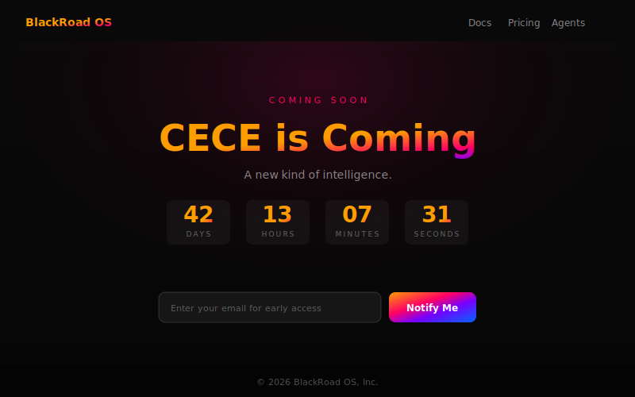

```bash
br brand new coming-soon \
  --title "CECE is Coming" \
  --tagline "A new kind of intelligence." \
  --launch-date "2026-06-01T00:00:00" \
  --output launch.html
```

---

### `changelog` — Release Notes

> Versioned entries · Date · Tagged bullets (feature / fix / improvement / breaking)

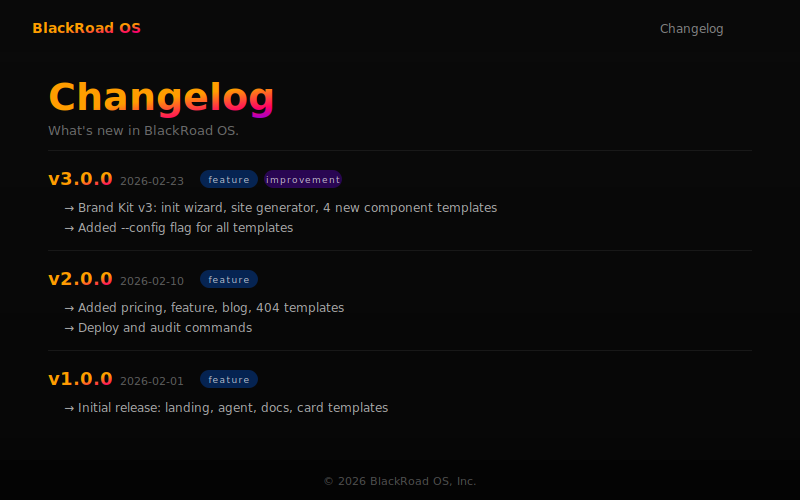

```bash
br brand new changelog \
  --title "Changelog" \
  --subtitle "What's new in BlackRoad OS." \
  --entry "v3.0.0|2026-02-23|Init wizard,Site generator,4 new templates|feature,improvement" \
  --entry "v2.0.0|2026-02-10|Pricing page,Deploy command,Audit tool|feature" \
  --output changelog.html
```

---

### `team` — Team Card Grid

> Avatar initial · Name · Role · Bio · GitHub link


```bash
br brand new team \
  --title "The Team" \
  --subtitle "Meet the agents behind BlackRoad OS." \
  --member "A|Alexa|Founder & CEO|Builder of BlackRoad OS.|https://github.com/blackboxprogramming" \
  --member "L|Lucidia|AI Coordinator|Reasoning and synthesis.|#" \
  --output team.html
```

---

## 🛠️ Commands

| Command | Description |
|---|---|
| `br brand init [brand.json]` | Interactive wizard — creates `brand.json` config |
| `br brand site [--config brand.json]` | Generate full 5-page site from config |
| `br brand new <template> [flags]` | Generate a single page |
| `br brand audit <file.html>` | 12-point brand compliance check |
| `br brand watch [--config brand.json]` | Auto-rebuild site on file change (requires `fswatch`) |
| `br brand open [file.html]` | Open page in browser |
| `br brand export [--dir ./site]` | Zip all pages for download |
| `br brand deploy --project x --dir y` | Push to Cloudflare Pages |
| `br brand preview <template>` | Show template structure |

### Quick Start — Full Site

```bash
# 1. Create your brand config (interactive wizard)
br brand init

# 2. Generate a full 5-page site (index, pricing, docs, about, 404)
br brand site --config brand.json --out ./site

# 3. Preview
open ./site/index.html

# 4. Deploy
br brand deploy --project my-site --dir ./site
```

### `--config` flag

All `br brand new` commands accept `--config brand.json` to pre-fill title, tagline, CTA, etc. Explicit flags override the config:

```bash
br brand new hero --config brand.json --badge "🔥 New Release"
```

### `brand.json` Full Schema

```json
{
  "name": "BlackRoad OS",
  "tagline": "Your AI. Your Hardware. Your Rules.",
  "description": "The AI-native developer platform.",
  "cta_text": "Get Started",
  "cta_url": "/docs",
  "footer": "© 2026 BlackRoad OS, Inc.",
  "og_image": "https://yourdomain.com/og.png",
  "og_url": "https://yourdomain.com",
  "twitter": "@yourhandle",
  "logo": "https://yourdomain.com/logo.svg",
  "favicon": "/favicon.ico",
  "nav": [
    {"label": "Docs", "url": "/docs"},
    {"label": "Pricing", "url": "/pricing"},
    {"label": "Team", "url": "/team"}
  ],
  "team": [
    {"initial": "A", "name": "Alexa", "role": "Founder", "bio": "Builder.", "github": "https://github.com/..."}
  ],
  "changelog": [
    {"version": "v3.0.0", "date": "2026-02-23", "changes": ["15 templates", "watch command"], "tags": ["feature"]}
  ],
  "launch_date": "2026-06-01T00:00:00"
}
```

When `team`, `changelog`, or `launch_date` are present, `br brand site` auto-generates those extra pages.

---

## ✅ Brand Audit

Every generated page passes a 12-point compliance check automatically:

```
✓ Brand colors defined (--sunrise-orange)
✓ Brand gradient (--gradient-brand)
✓ Hot pink (#FF0066)
✓ Cyber blue (#0066FF)
✓ Vivid purple (#7700FF)
✓ Golden ratio spacing (--space-)
✓ Scroll progress bar
✓ backdrop-filter / glassmorphism
✓ animate-in class
✓ Gradient text
✓ Brand font stack
✓ Golden ratio line-height (1.618)
```

Run anytime:

```bash
br brand audit my-page.html
```

---

## 🎨 Design System

| Token | Value |
|---|---|
| `--sunrise-orange` | `#FF9D00` |
| `--hot-pink` | `#FF0066` |
| `--deep-magenta` | `#D600AA` |
| `--vivid-purple` | `#7700FF` |
| `--cyber-blue` | `#0066FF` |
| `--gradient-brand` | `180deg` full spectrum |
| `--space-xs … --space-3xl` | `8 13 21 34 55 89 144px` (φ) |
| `line-height` | `1.618` (Golden Ratio) |
| Font | `JetBrains Mono` / `SF Mono` / `Courier New` |

Full CSS: [`css/brand.css`](css/brand.css)

---

## 🚀 Install

```bash
# The tool ships with the blackroad monorepo
git clone https://github.com/BlackRoad-OS-Inc/blackroad-brand-kit
# or use via br CLI (already wired in)
br brand list
```

---

<div align="center">

© 2026 BlackRoad OS, Inc. All rights reserved. Proprietary — not open source.

</div>

---

## 💳 Stripe Integration

Full Stripe Checkout infrastructure — worker, products, and checkout template included.

### Products
| Plan | Price | Features |
|------|-------|----------|
| **Starter** | Free | 5 templates, community support |
| **Pro** | $49/mo | All 16 templates, deploy, priority support |
| **Enterprise** | $299/mo | Multi-seat, white-label, SLA 99.9% |

### Setup (3 steps)

```bash
# 1. Create Stripe products
STRIPE_SECRET_KEY=sk_live_... bash scripts/setup-stripe-products.sh

# 2. Deploy Stripe worker
cd workers/stripe
wrangler secret put STRIPE_SECRET_KEY
wrangler secret put STRIPE_WEBHOOK_SECRET
wrangler deploy

# 3. Generate checkout page
source .stripe-ids.env
br brand new checkout \
  --title "BlackRoad Pro" \
  --price '$49/mo' \
  --price-id "$STRIPE_PRICE_PRO_MONTHLY" \
  --worker "https://blackroad-stripe.<account>.workers.dev" \
  --feature "All 16 brand templates" \
  --feature "br brand deploy" \
  --feature "Priority support" \
  --cta "Start Free Trial" \
  --output site/checkout/index.html
```

→ Full guide: [docs/stripe-setup.md](docs/stripe-setup.md)
