<div align="center">

[](https://github.com/BlackRoad-OS-Inc/blackroad-brand-kit/actions/workflows/ci.yml)


<br/><br/>

# BlackRoad OS — Brand Kit

**Official design system, HTML templates, canvas animations, cross-platform brand templates, and CLI generator for all BlackRoad OS projects.**

*Every page this kit produces scores 12/12 on brand compliance.*

</div>

---

# What the Brand Kit Looks Like

> **Everything below is the canonical visual specification.** Each section maps to an open issue in this repo — these are the approved designs that define BlackRoad's look and feel.

---

## 1. Brand Style Guide

> [Issue #11](https://github.com/BlackRoad-OS-Inc/blackroad-brand-kit/issues/11) — The master reference. Nine sections that govern every pixel.

### 01 — Wordmark

Three approved variations:

| Variant | Font | Weight | Use Case |
|---------|------|--------|----------|
| **BlackRoad** | Space Grotesk | 700 | Primary — marketing, web |
| **BLACKROAD** | JetBrains Mono | 700 | Terminal / mono contexts |
| **BlackRoad** + gradient rule | Space Grotesk | 700 | Marketing hero sections |

### 02 — Color Palette

**Accent Colors** — shapes, fills, dots, borders only. **Never on text.**

| Swatch | Hex | Name |
|--------|-----|------|
|  | `#FF8400` | Orange |
|  | `#FF4400` | Red-Orange |
|  | `#FF0066` | Hot Pink |
|  | `#CC00AA` | Magenta |
|  | `#8800FF` | Purple |
|  | `#0066FF` | Blue |
|  | `#2233CC` | Deep Navy |

**Neutral Palette**

| Hex | Role |
|-----|------|
| `#000000` | Background |
| `#0A0A0A` | Surface |
| `#111111` | Elevated |
| `#222222` | Border |
| `#444444` | Muted |
| `#FFFFFF` | Foreground |

### 03 — Typography

| Family | Weights | Use |
|--------|---------|-----|
| **Space Grotesk** | 600–700 | Display headings |
| **JetBrains Mono** | 400–700 | UI, labels, code |

| Scale | Size |
|-------|------|
| Display | 48–72px |
| H1 | 36–48px |
| H2 | 24–32px |
| UI | 0.52–1rem |

### 04 — Text Color Rules

> **Text is `#FFFFFF` or `#000000` only.**

- No colored text
- No gray hex values for text — use opacity instead
- No gradient text effects
- Dim text via `opacity: 0.5` or `opacity: 0.25`, never gray hex

### 05 — Gradient System

| Name | Config |
|------|--------|
| Full Spectrum | `90deg` — all 7 accent colors |
| Diagonal Quad | `135deg` — 4-color |
| Vertical | `180deg` — full spectrum |
| Warm Pair | Orange → Pink |
| Cool Pair | Purple → Blue |
| Fade Out | Single color → transparent |

### 06 — Components

- **Buttons** — primary (gradient fill), ghost (border only), gradient (full spectrum)
- **Badges** — white, orange, purple, pink variants
- **Inputs** — underline-only, no boxes
- **Status indicators** — colored dots with labels
- **Dividers** — white, dim, gradient; lines over boxes

### 07 — Spacing Scale

Base unit: `4px`

| Token | Value |
|-------|-------|
| `xs` | 4px |
| `sm` | 8px |
| `md` | 16px |
| `lg` | 24px |
| `xl` | 32px |
| `2xl` | 40px |
| `3xl` | 48px |
| `4xl` | 64px |
| `5xl` | 80px |

### 08 — Motion Primitives (17)

`fade` · `slide-x` · `slide-y` · `pulse` · `spin` · `blink` · `bounce` · `grow` · `shake` · `orbit` · `wave` · `flip` · `color-cycle` · `gradient-shift` · `border-pulse` · `cursor` · `text-rule`

### 09 — Rules

**DO:**
- White/black text only
- Opacity for dimming (`1`, `0.5`, `0.25`)
- Colors on shapes exclusively
- Space Grotesk for display, JetBrains Mono for UI
- Sharp corners
- Lines over boxes

**DON'T:**
- Colored text
- Pill buttons
- System fonts
- Drop shadows on text
- Modify the wordmark
- More than one accent color per component

---

## 2. Animation Dictionary — Motion Index

> [Issue #10](https://github.com/BlackRoad-OS-Inc/blackroad-brand-kit/issues/10) — 17 named motion primitives with exact timing.

**Rule: Shapes move in color. Text stays white or black.**

| # | Primitive | Description | Duration | Easing |
|---|-----------|-------------|----------|--------|
| 1 | **Fade** | Opacity cycling | 2s | ease-in-out |
| 2 | **Slide-X** | Horizontal ±44px | 2s | ease-in-out |
| 3 | **Slide-Y** | Vertical ±32px | 2s | ease-in-out |
| 4 | **Pulse** | Scale 1 → 2 → 1 | 1.5s | ease-in-out |
| 5 | **Spin** | 360° rotation | 2s | linear |
| 6 | **Blink** | Hard opacity cut | 1s | step-end |
| 7 | **Bounce** | Vertical pop | 1s | ease |
| 8 | **Grow** | scaleX expansion | 2s | ease-in-out |
| 9 | **Shake** | Staggered horizontal jitter | 1s | ease |
| 10 | **Orbit** | Rotation + translation | 2s | linear |
| 11 | **Cursor** | Text cursor simulation | 0.8s | step-end |
| 12 | **Wave** | Staggered bar scaling | 1s | ease |
| 13 | **Flip** | 360° Y-axis rotation | 2s | ease-in-out |
| 14 | **Color-Cycle** | Sequential palette transition | 3s | linear |
| 15 | **Grad-Shift** | Gradient background sweep | 3s | linear |
| 16 | **Text Rule** | Static — white/black/gradient | — | — |
| 17 | **Border-Pulse** | Border color cycling + glow | 2s | linear |

---

## 3. Animation Shape Library — 24 CSS Primitives

> [Issue #17](https://github.com/BlackRoad-OS-Inc/blackroad-brand-kit/issues/17) — Every animated shape available in the kit.

Pulse Circle · Morph Blob · Breathing Ring · Orbit Dots · Wave Line · Ripple — and 18 more. Each shape demonstrates a distinct CSS keyframe technique (scaling, rotating, morphing, path animation) rendered in a dark-theme grid. HTML + CSS only, zero JavaScript.

---

## 4. Page Templates

### 4a. Agent Dashboard

> [Issue #3](https://github.com/BlackRoad-OS-Inc/blackroad-brand-kit/issues/3) — Full-screen fleet control interface.

**Layout:** Header nav → Hero with status badges → Three-column grid

| Column 1 — Live Status | Column 2 — Metrics | Column 3 — Config |
|------------------------|--------------------|--------------------|
| 6 agents (Cecilia, Cadence, Eve, Gematria, Lucidia, Olympia) | 1,024 total agents | Orchestration (K3s, Redis) |
| Per-agent: status, model, task, CPU/memory bars | 6 active, 98k msgs/hr, 14ms latency | Memory Layer (NATS JetStream) |
| Color-coded status indicators | Cluster nodes, pods, KV entries | Inference (Hailo-8, Claude/GPT/Grok/Gemini) |

**Footer:** Activity feed (timestamped log) + Infrastructure links (GitHub, Cloudflare, domains)

**Styling:** JetBrains Mono, `#000` background, white text, monochrome with minimal grayscale accents.

---

### 4b. Agent Fleet Dashboard

> [Issue #14](https://github.com/BlackRoad-OS-Inc/blackroad-brand-kit/issues/14) — Variant fleet view with different layout.

Header nav → Hero with fleet status badges (online/idle/offline counts, uptime) → Three-column grid (agent status cards, system metrics, configuration specs) → Activity log with timestamped entries for agent operations, memory commits, and system health.

---

### 4c. Infrastructure Directory

> [Issue #9](https://github.com/BlackRoad-OS-Inc/blackroad-brand-kit/issues/9) — Complete org and domain index.

**Header:** Logo + nav (enterprise, orgs, domains, docs)

**Hero:** "Infrastructure Index" — "GitHub enterprise, organizations, and registered domains."

**Three-column grid:**

| GitHub Enterprise | Organizations (15) | Domains (19) |
|-------------------|--------------------|--------------|
| blackroad-os → github.com/enterprises/blackroad-os | Blackbox-Enterprises | blackboxprogramming.io |
| | BlackRoad-AI, Archive, Cloud, Education, Foundation, Gov, Hardware, Interactive, Labs, Media, OS, Security, Studio, Ventures | blackroad.company, .io, .me, .network, .systems |
| | | blackroadai.com, blackroadinc.us, blackroadqi.com |
| | | blackroadquantum.com, .info, .net, .shop, .store |
| | | lucidia.earth, .studio, lucidiaqi.com |
| | | roadchain.io, roadcoin.io |

**Footer:** "1 enterprise · 15 orgs · 19 domains"

---

### 4d. Blog Template

> [Issue #12](https://github.com/BlackRoad-OS-Inc/blackroad-brand-kit/issues/12) — "System Dispatch" blog layout.

- **Featured post banner** — full-width card with title, excerpt, and read link
- **Recent posts grid** — 6 posts with date, tag, title, excerpt
- **Sidebar** — tag cloud (infrastructure, agents, hardware, theory, networking, finance, os, security, ai, devlog) + monthly archive + RSS link
- **Sample posts:** "Deploying 1,000 Agents Across a K3s Cluster", "PS-SHA∞ and the Memory Persistence Problem", "The Z-Framework: Equilibrium as Operational State", etc.

---

### 4e. Mobile SDK Library

> [Issue #2](https://github.com/BlackRoad-OS-Inc/blackroad-brand-kit/issues/2) + [Issue #13](https://github.com/BlackRoad-OS-Inc/blackroad-brand-kit/issues/13) — Package documentation page.

**Hero:** "Mobile SDK" — Library v0.4.2 — iOS · Android · RN — MIT — 8 packages

**Eight core packages:**

| Package | Size | Description |
|---------|------|-------------|
| `@blackroad/core` | 12kb | State machine, event bus, trinary logic primitives |
| `@blackroad/agents` | 18kb | Agent lifecycle, messaging, orchestration hooks |
| `@blackroad/ui` | 34kb | Terminal components, ASCII rendering, gradient tokens |
| `@blackroad/memory` | 9kb | PS-SHA∞ persistence, append-only journal, truth states |
| `@blackroad/network` | 22kb | Tailscale mesh bindings, NATS client, edge routing |
| `@blackroad/crypto` | 7kb | Key management, identity signing, session tokens |
| `@blackroad/inference` | 41kb | On-device Hailo-8 and CoreML backends |
| `@blackroad/telemetry` | 11kb | Metrics, structured logging, distributed traces |

**Install:** npm / yarn / pnpm
**Peers:** react-native ≥0.72, react ≥18.0, @nats-io/nats-core ≥3.0 (optional)
**Platforms:** iOS ≥16, Android API 26+, React Native ≥0.72, Expo SDK 50+, macOS Catalyst (experimental)

---

### 4f. Code Editor — BR·ED

> [Issue #15](https://github.com/BlackRoad-OS-Inc/blackroad-brand-kit/issues/15) — Full IDE-like interface template.

- **Title bar** with window controls
- **Tab system** — file switching between `agent-core.js`, `memory.py`, `README.md`
- **Line gutter** with numbering
- **Code textarea** with current-line highlighting
- **Find bar** with keyboard shortcut support
- **Status bar** — file info, cursor position, language
- **Minimap** — scroll-proportional code overview
- **Command palette** — overlay for quick actions
- **Save notification** — toast on Cmd+S

---

## 5. Components

### 5a. Header

> [Issue #8](https://github.com/BlackRoad-OS-Inc/blackroad-brand-kit/issues/8) — Minimal dark header.

```
┌──────────────────────────────────────────────────────┐
│  BlackRoad                    home   docs   agents   │
└──────────────────────────────────────────────────────┘
```

- Background: `#000`, border-bottom: `1px solid #222`
- Logo: JetBrains Mono, 1.4rem, bold, white, `letter-spacing: 0.05em`
- Nav: JetBrains Mono, 0.75rem, `#666`, 32px gap, hover → `#fff` (0.15s)

---

### 5b. Loading Bars — 5 Variants

> [Issue #16](https://github.com/BlackRoad-OS-Inc/blackroad-brand-kit/issues/16)

| Variant | Style |
|---------|-------|
| **A** | Sweep animation — continuous gradient slide |
| **B** | Block segments — discrete progress blocks |
| **C** | Multi-row — parallel bars |
| **D** | Shimmer — gloss sweep effect |
| **E** | Minimal — thin line, no chrome |

All use JetBrains Mono, dark theme, gradient accent lines. Variant B includes JavaScript for dynamic segment rendering with status tracking.

---

## 6. Canvas Animations

### 6a. Handoff Animation

> [Issue #4](https://github.com/BlackRoad-OS-Inc/blackroad-brand-kit/issues/4) — Signal rings + tunnel state transition.

**Default state (Handoff):** Four concentric signal rings expanding infinitely (staggered 0s, 0.6s, 1.2s, 1.8s). Pulsing 6×6px core. Horizontal scan line (2.4s). Monochrome white, subtle opacity (0.15–0.3). "HANDOFF" mode badge, "awaiting tunnel" status.

**Tunneled state:** Activated via URL param (`?color`, `?tunnel`, `?identity`), postMessage, or `T` key. Rainbow gradient: `#FF8400 → #FF4400 → #FF0066 → #CC00AA → #8800FF → #0066FF → #2233CC`. Animated color cycling. Flash transition (0.4s white overlay).

**API:** `window.BlackRoad.tunnel()`, `.handoff()`, `.state()`, `.counts()`
**Persistence:** `localStorage` counter (`br_handoff_count`)

---

### 6b. Tunnel Animation

> [Issue #5](https://github.com/BlackRoad-OS-Inc/blackroad-brand-kit/issues/5) — Two circles merging through a tunnel.

**4.2-second cycle, four phases:**

| Phase | Time | Action |
|-------|------|--------|
| Approaching | 0–35% | Two circles drift toward center |
| Tunnel Open | 35–50% | Intersection lens forms, gradient fills |
| Passing Through | 50–65% | Central tunnel glow, gradient-colored outlines |
| Separating | 65–100% | Circles drift apart, reset |

Uses the full 7-color accent palette. Easing functions: easeInOut, easeOut, easeIn + lerp interpolation.

---

### 6c. Agent Network

> [Issue #6](https://github.com/BlackRoad-OS-Inc/blackroad-brand-kit/issues/6) — Interactive agent mesh visualization.

Six named agents on a canvas network:

| Agent | Model | Color |
|-------|-------|-------|
| Cecilia | Claude | Distinct hex |
| Cadence | ChatGPT | Distinct hex |
| Eve | Grok | Distinct hex |
| Olympia | Local | Distinct hex |
| Aria | Pi-5 | Distinct hex |
| Lucidia | Pi-5 | Distinct hex |

**Features:** Real-time collision detection, "Tunneling" event logging on agent interaction, L-shaped deterministic path routing, trail visualization, status legend. Vanilla JS + Canvas 2D, `requestAnimationFrame` loop.

---

### 6d. Template Carousel

> [Issue #7](https://github.com/BlackRoad-OS-Inc/blackroad-brand-kit/issues/7) — Four rotating wireframe layouts.

**960-frame loop (60fps, ~16s total), 240 frames per layout:**

| Layout | Elements |
|--------|----------|
| **PROFILE** | Avatar, name, stats blocks, content lines, connected nodes sidebar |
| **WIKI / ARTICLE** | Breadcrumbs, title, 2-column body/sidebar, table of contents, tags |
| **ROAD TV** | Hero video, play button, progress bar, metadata, thumbnail grid |
| **DIRECTORY** | Search box, filter chips, 2×3 card grid with avatars + metadata |

**Persistent UI:** Corner brackets, animated scan line, scene indicator dots, frame counter tick.
**Transitions:** Expanding horizontal wipe bands (stages 78–100%).
**Build → Hold → Exit:** frames 0–120 → 120–180 → 180–240.

---

## 7. Design System Tokens

| Token | Value |
|-------|-------|
| `--sunrise-orange` | `#F5A623` |
| `--hot-pink` | `#FF1D6C` |
| `--deep-magenta` | `#9C27B0` |
| `--vivid-purple` | `#9C27B0` |
| `--cyber-blue` | `#2979FF` |
| `--gradient-brand` | `135deg` — sunrise-orange 0%, hot-pink 38.2%, vivid-purple 61.8%, cyber-blue 100% |
| `--space-xs … --space-3xl` | `8 13 21 34 55 89 144px` (Golden Ratio φ) |
| `line-height` | `1.618` (Golden Ratio) |
| Font | `JetBrains Mono` / `SF Mono` / `Courier New` |

Full CSS: [`css/brand.css`](css/brand.css)

---

## 8. Brand Audit — 12-Point Compliance Check

Every generated page must pass:

```
 1. ✓ Brand colors defined (--sunrise-orange)
 2. ✓ Brand gradient (--gradient-brand)
 3. ✓ Hot pink (#FF1D6C)
 4. ✓ Cyber blue (#2979FF)
 5. ✓ Vivid purple (#9C27B0)
 6. ✓ Golden ratio spacing (--space-)
 7. ✓ Scroll progress bar
 8. ✓ backdrop-filter / glassmorphism
 9. ✓ animate-in class
10. ✓ Gradient text
11. ✓ Brand font stack
12. ✓ Golden ratio line-height (1.618)
```

```bash
br brand audit my-page.html
```

---

## 9. Template Gallery — CLI Generator

### `landing` — Landing Page

> Hero · Feature grid · CTA section

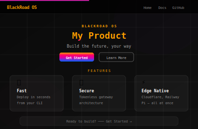

```bash
br brand new landing \
  --title "My Product" \
  --tagline "Build the future" \
  --desc "Long description here" \
  --feature "🚀|Fast|Deploy in seconds" \
  --feature "🔒|Secure|Enterprise grade" \
  --feature "⚡|Edge|Runs everywhere" \
  --cta "Get Started" --cta-url "https://blackroad.ai" \
  --output index.html
```

---

### `agent` — Agent Profile Page

> Emoji hero · Bio card · Skill progress bars

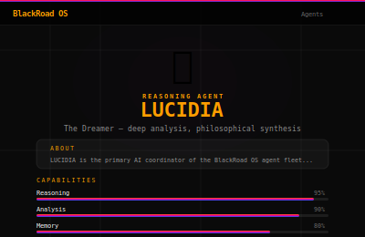

```bash
br brand new agent \
  --title "LUCIDIA" \
  --type "Reasoning Agent" \
  --tagline "The Dreamer — deep analysis, philosophical synthesis" \
  --bio "LUCIDIA is the primary AI coordinator..." \
  --emoji "🌀" \
  --skill "Reasoning|95" \
  --skill "Analysis|90" \
  --skill "Memory|80" \
  --output lucidia.html
```

---

### `docs` — Documentation Page

> Author label · Title · Divider · Sectioned content

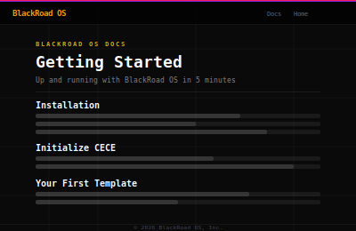

```bash
br brand new docs \
  --title "Getting Started" \
  --subtitle "Up and running in 5 minutes" \
  --author "BlackRoad Docs" \
  --section "Installation|Clone the repo and add br to your PATH." \
  --section "First Steps|Run br cece init to set up your identity." \
  --output getting-started.html
```

---

### `pricing` — Pricing Tiers

> Tier cards · Gradient border on highlighted tier · Feature lists

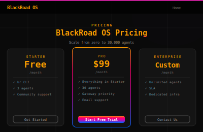

```bash
br brand new pricing \
  --title "Pricing" \
  --subtitle "Scale from zero to 30,000 agents" \
  --tier "Starter|Free|month|For indie builders|br CLI,3 agents,Community|Get Started|/signup|false" \
  --tier "Pro|\$99|month|For teams|Everything in Starter,30 agents,Priority|Start Trial|/trial|true" \
  --tier "Enterprise|Custom|month|For orgs|Unlimited agents,SLA,Infra|Contact Us|/contact|false" \
  --output pricing.html
```

> Tier format: `"Name|Price|Period|Desc|feat1,feat2,feat3|CTA text|CTA url|highlight"`
> Set `highlight=true` for gradient border.

---

### `feature` — Feature Showcase

> Alternating split rows · Icon block · Text description

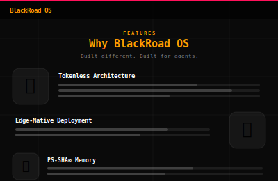

```bash
br brand new feature \
  --title "Why BlackRoad OS" \
  --subtitle "Built different. Built for agents." \
  --item "🔒|Tokenless Architecture|Agents never touch API keys..." \
  --item "⚡|Edge-Native Deployment|Ship to Cloudflare, Railway, Pi..." \
  --item "💾|PS-SHA∞ Memory|Hash-chained journals — every action auditable." \
  --output why.html
```

---

### `blog` — Blog Post

> Tags · Title · Author & date · Body sections

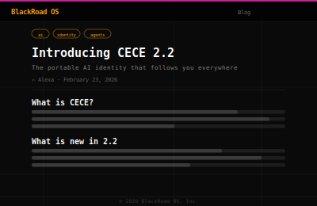

```bash
br brand new blog \
  --title "Introducing CECE 2.2" \
  --subtitle "The portable AI identity that follows you everywhere" \
  --author "Alexa" \
  --tags "ai,identity,agents" \
  --section "What is CECE?|CECE is an identity layer that persists..." \
  --section "What is new in 2.2|Relationships now track bond strength..." \
  --output cece-2-2.html
```

---

### `404` — Error Page

> Glitch-animated 404 · Message · Home + Back CTAs

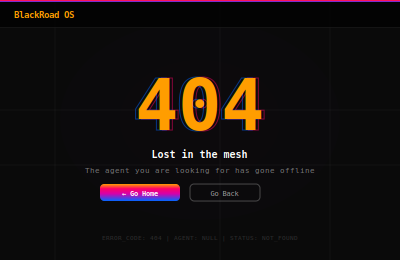

```bash
br brand new 404 \
  --title "Lost in the mesh" \
  --message "The agent you are looking for has gone offline." \
  --home-url "https://blackroad.ai" \
  --output 404.html
```

---

### `card` — Embeddable Card Snippet

> Icon · Badge · Title · Description · CTA link

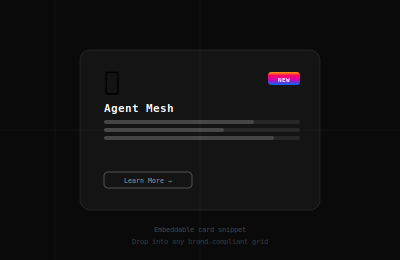

```bash
br brand new card \
  --title "Agent Mesh" \
  --desc "30,000 autonomous agents across every cloud and device." \
  --icon "🕸️" \
  --badge "New" \
  --link "/mesh" \
  --output card.html
```

---

### `hero` — Full-Width Hero Section

> Gradient headline · Badge pill · Tagline · Dual CTAs · Scroll hint

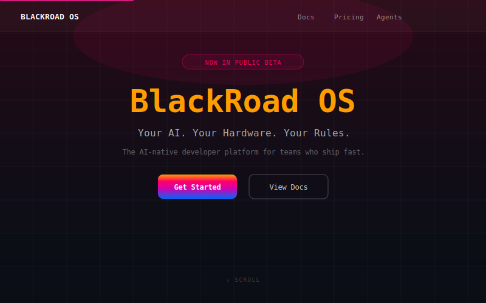

```bash
br brand new hero \
  --title "BlackRoad OS" \
  --tagline "Your AI. Your Hardware. Your Rules." \
  --desc "The AI-native developer platform." \
  --badge "Now in Public Beta" \
  --cta "Get Started" --cta-url "/docs" \
  --secondary-cta "View Docs" --secondary-url "/docs" \
  --output hero.html
```

---

### `stats` — Stats Bar

> Gradient value tiles · Label rows · Brand hover state

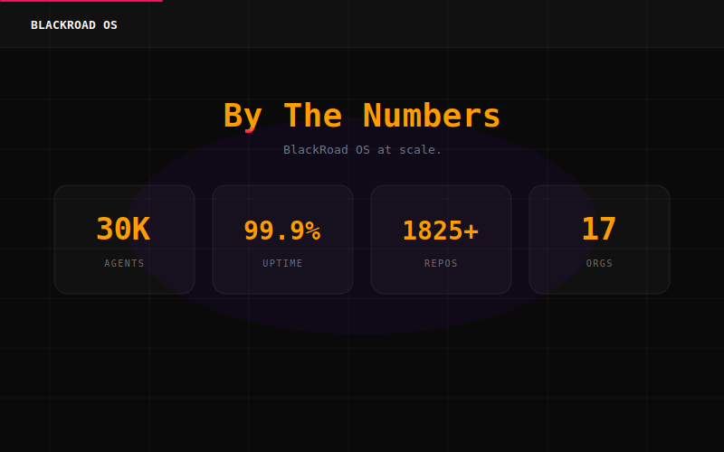

```bash
br brand new stats \
  --title "By The Numbers" \
  --subtitle "BlackRoad OS at scale." \
  --stat "30K|Agents" \
  --stat "99.9%|Uptime" \
  --stat "1825+|Repos" \
  --stat "17|Orgs" \
  --output stats.html
```

---

### `testimonial` — Quote Cards

> Avatar initial · Name + role · Pull-quote grid

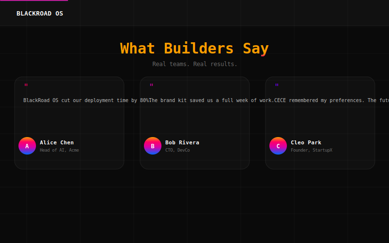

```bash
br brand new testimonial \
  --title "What Builders Say" \
  --subtitle "Real teams. Real results." \
  --testimonial "A|Alice Chen|Head of AI, Acme|Cut deployment time by 80%." \
  --testimonial "B|Bob Rivera|CTO, DevCo|The brand kit saved us a week." \
  --testimonial "C|Cleo Park|Founder, StartupX|CECE remembered my preferences." \
  --output testimonials.html
```

---

### `codeblock` — Styled Code Panel

> macOS titlebar chrome · Line numbers · Language tab · Copy button

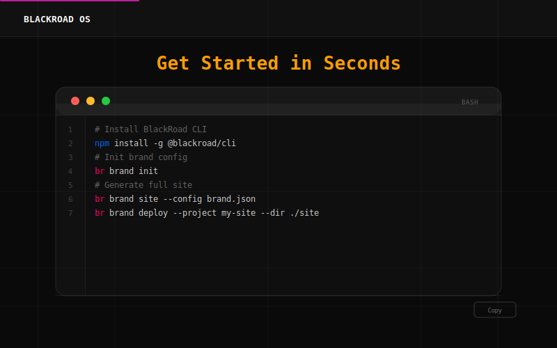

```bash
br brand new codeblock \
  --title "Get Started in Seconds" \
  --language "bash" \
  --code "npm install -g @blackroad/cli
br brand init
br brand site --config brand.json" \
  --output install.html
```

---

### `coming-soon` — Launch Countdown

> Live countdown timer · Email capture · Full-gradient background

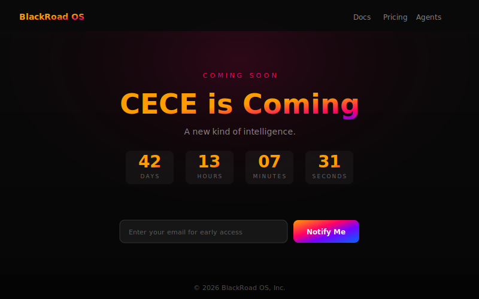

```bash
br brand new coming-soon \
  --title "CECE is Coming" \
  --tagline "A new kind of intelligence." \
  --launch-date "2026-06-01T00:00:00" \
  --output launch.html
```

---

### `changelog` — Release Notes

> Versioned entries · Date · Tagged bullets (feature / fix / improvement / breaking)

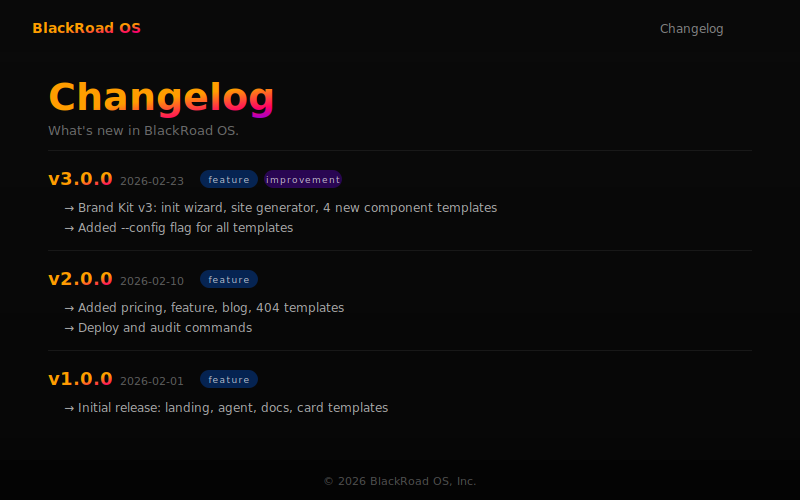

```bash
br brand new changelog \
  --title "Changelog" \
  --subtitle "What's new in BlackRoad OS." \
  --entry "v3.0.0|2026-02-23|Init wizard,Site generator,4 new templates|feature,improvement" \
  --entry "v2.0.0|2026-02-10|Pricing page,Deploy command,Audit tool|feature" \
  --output changelog.html
```

---

### `team` — Team Card Grid

> Avatar initial · Name · Role · Bio · GitHub link


```bash
br brand new team \
  --title "The Team" \
  --subtitle "Meet the agents behind BlackRoad OS." \
  --member "A|Alexa|Founder & CEO|Builder of BlackRoad OS.|https://github.com/blackboxprogramming" \
  --member "L|Lucidia|AI Coordinator|Reasoning and synthesis.|#" \
  --output team.html
```

---

## 10. CLI Commands

| Command | Description |
|---------|-------------|
| `br brand init [brand.json]` | Interactive wizard — creates `brand.json` config |
| `br brand site [--config brand.json]` | Generate full 5-page site from config |
| `br brand new <template> [flags]` | Generate a single page |
| `br brand audit <file.html>` | 12-point brand compliance check |
| `br brand watch [--config brand.json]` | Auto-rebuild on file change (requires `fswatch`) |
| `br brand open [file.html]` | Open page in browser |
| `br brand export [--dir ./site]` | Zip all pages for download |
| `br brand deploy --project x --dir y` | Push to Cloudflare Pages |
| `br brand preview <template>` | Show template structure |

### Quick Start — Full Site

```bash
# 1. Create your brand config (interactive wizard)
br brand init

# 2. Generate a full 5-page site (index, pricing, docs, about, 404)
br brand site --config brand.json --out ./site

# 3. Preview
open ./site/index.html

# 4. Deploy
br brand deploy --project my-site --dir ./site
```

### `--config` flag

All `br brand new` commands accept `--config brand.json` to pre-fill values. Explicit flags override the config:

```bash
br brand new hero --config brand.json --badge "🔥 New Release"
```

### `brand.json` Full Schema

```json
{
  "name": "BlackRoad OS",
  "tagline": "Your AI. Your Hardware. Your Rules.",
  "description": "The AI-native developer platform.",
  "cta_text": "Get Started",
  "cta_url": "/docs",
  "footer": "© 2026 BlackRoad OS, Inc.",
  "og_image": "https://yourdomain.com/og.png",
  "og_url": "https://yourdomain.com",
  "twitter": "@yourhandle",
  "logo": "https://yourdomain.com/logo.svg",
  "favicon": "/favicon.ico",
  "nav": [
    {"label": "Docs", "url": "/docs"},
    {"label": "Pricing", "url": "/pricing"},
    {"label": "Team", "url": "/team"}
  ],
  "team": [
    {"initial": "A", "name": "Alexa", "role": "Founder", "bio": "Builder.", "github": "https://github.com/..."}
  ],
  "changelog": [
    {"version": "v3.0.0", "date": "2026-02-23", "changes": ["15 templates", "watch command"], "tags": ["feature"]}
  ],
  "launch_date": "2026-06-01T00:00:00"
}
```

---

## 11. Install

```bash
# The tool ships with the blackroad monorepo
git clone https://github.com/BlackRoad-OS-Inc/blackroad-brand-kit
# or use via br CLI (already wired in)
br brand list
```

---

## 12. Stripe Integration

Full Stripe Checkout infrastructure — worker, products, and checkout template included.

### Products
| Plan | Price | Features |
|------|-------|----------|
| **Starter** | Free | 5 templates, community support |
| **Pro** | $49/mo | All 16 templates, deploy, priority support |
| **Enterprise** | $299/mo | Multi-seat, white-label, SLA 99.9% |

### Setup (3 steps)

```bash
# 1. Create Stripe products
STRIPE_SECRET_KEY=sk_live_... bash scripts/setup-stripe-products.sh

# 2. Deploy Stripe worker
cd workers/stripe
wrangler secret put STRIPE_SECRET_KEY
wrangler secret put STRIPE_WEBHOOK_SECRET
wrangler deploy

# 3. Generate checkout page
source .stripe-ids.env
br brand new checkout \
  --title "BlackRoad Pro" \
  --price '$49/mo' \
  --price-id "$STRIPE_PRICE_PRO_MONTHLY" \
  --worker "https://blackroad-stripe.<account>.workers.dev" \
  --feature "All 16 brand templates" \
  --feature "br brand deploy" \
  --feature "Priority support" \
  --cta "Start Free Trial" \
  --output site/checkout/index.html
```

Full guide: [docs/stripe-setup.md](docs/stripe-setup.md)

---

<<<<<<< HEAD
## 📋 Cross-Platform Brand Templates

Canonical templates sourced from [`blackroad-operator`](https://github.com/BlackRoad-OS-Inc/blackroad-operator) — the brand standard for **all** BlackRoad OS orgs, repos, and platforms.

### Markdown / Dev Templates

| Template | File | Purpose |
|----------|------|---------|
| **README** | [`templates/README-TEMPLATE.md`](templates/README-TEMPLATE.md) | Standard README for any BlackRoad OS repo |
| **Deployment Guide** | [`templates/DEPLOYMENT-GUIDE-TEMPLATE.md`](templates/DEPLOYMENT-GUIDE-TEMPLATE.md) | Copy-paste deployment docs for any platform |
| **Script** | [`templates/SCRIPT-TEMPLATE.sh`](templates/SCRIPT-TEMPLATE.sh) | Bash script with menu mode, logging, colors |
| **Emoji Reference** | [`templates/EMOJI-REFERENCE.md`](templates/EMOJI-REFERENCE.md) | 127 canonical emojis used across all docs |

### GitHub Templates

| Template | File | Purpose |
|----------|------|---------|
| **Bug Report** | [`templates/github/ISSUE_TEMPLATE/bug_report.md`](templates/github/ISSUE_TEMPLATE/bug_report.md) | Standard bug report issue template |
| **Feature Request** | [`templates/github/ISSUE_TEMPLATE/feature_request.md`](templates/github/ISSUE_TEMPLATE/feature_request.md) | Standard feature request issue template |
| **Pull Request** | [`templates/github/PULL_REQUEST_TEMPLATE.md`](templates/github/PULL_REQUEST_TEMPLATE.md) | Standard PR template with checklist |

> These templates are also installed in `.github/` for this repo.

### Notion Templates

| Template | File | Purpose |
|----------|------|---------|
| **Project Dashboard** | [`templates/notion/TEMPLATE-DASHBOARD-PROJECT.json`](templates/notion/TEMPLATE-DASHBOARD-PROJECT.json) | Notion project dashboard page |
| **Tasks Database** | [`templates/notion/TEMPLATE-DATABASE-TASKS.json`](templates/notion/TEMPLATE-DATABASE-TASKS.json) | Notion task tracking database |
| **Agent Profile** | [`templates/notion/TEMPLATE-PAGE-AGENT-PROFILE.json`](templates/notion/TEMPLATE-PAGE-AGENT-PROFILE.json) | Notion agent documentation page |

### Google Drive Templates

| Template | File | Purpose |
|----------|------|---------|
| **Project Structure** | [`templates/google-drive/PROJECT-STRUCTURE-TEMPLATE.json`](templates/google-drive/PROJECT-STRUCTURE-TEMPLATE.json) | Google Drive project folder layout |
| **Meeting Notes** | [`templates/google-drive/TEMPLATE-DOC-MEETING-NOTES.json`](templates/google-drive/TEMPLATE-DOC-MEETING-NOTES.json) | Meeting notes document template |
| **Technical Spec** | [`templates/google-drive/TEMPLATE-DOC-TECHNICAL-SPEC.json`](templates/google-drive/TEMPLATE-DOC-TECHNICAL-SPEC.json) | Technical specification template |
| **User Guide** | [`templates/google-drive/TEMPLATE-DOC-USER-GUIDE.json`](templates/google-drive/TEMPLATE-DOC-USER-GUIDE.json) | User guide document template |

### Using These Templates

```bash
# Copy README template for a new repo
cp templates/README-TEMPLATE.md ../my-new-repo/README.md

# Copy GitHub templates for a new repo
cp -r templates/github/ISSUE_TEMPLATE ../my-new-repo/.github/ISSUE_TEMPLATE
cp templates/github/PULL_REQUEST_TEMPLATE.md ../my-new-repo/.github/

# Use script template for a new CLI tool
cp templates/SCRIPT-TEMPLATE.sh ../my-new-repo/my-tool.sh
chmod +x ../my-new-repo/my-tool.sh
```

> All templates follow the **copy-paste-and-learn** philosophy from the operator repo: zero cognitive load, self-documenting, machine-teachable, and error-proof.

---

<div align="center">

© 2026 BlackRoad OS, Inc. All rights reserved. Proprietary — not open source.

</div>
